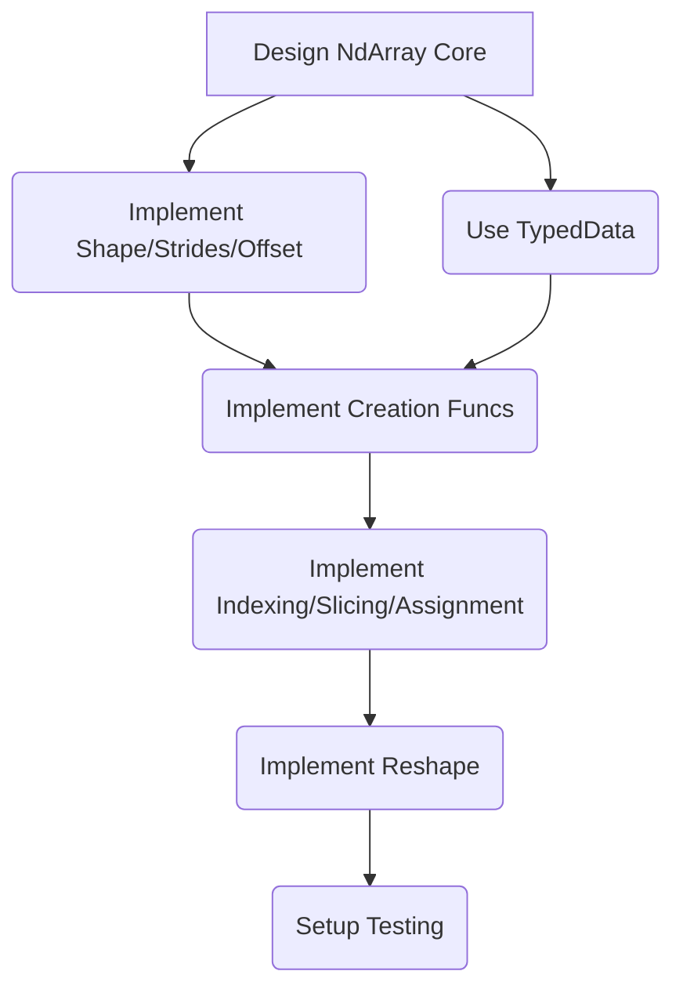
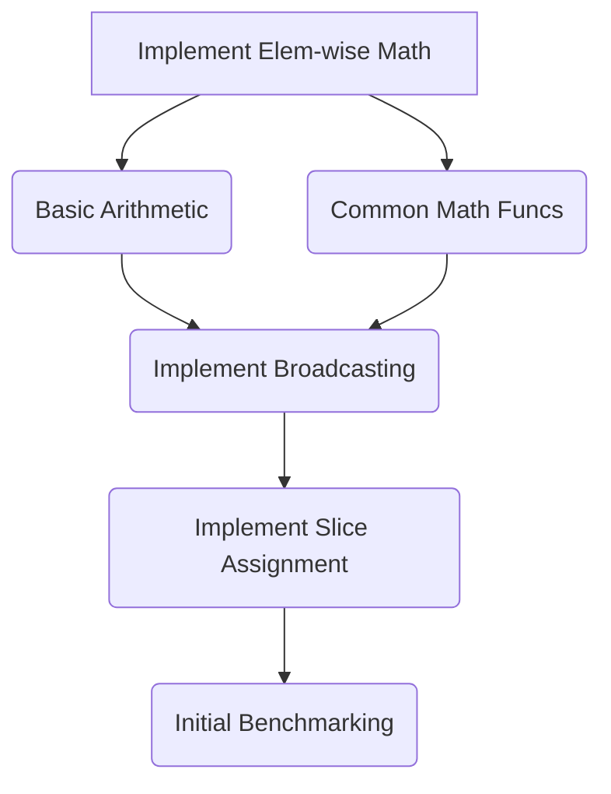
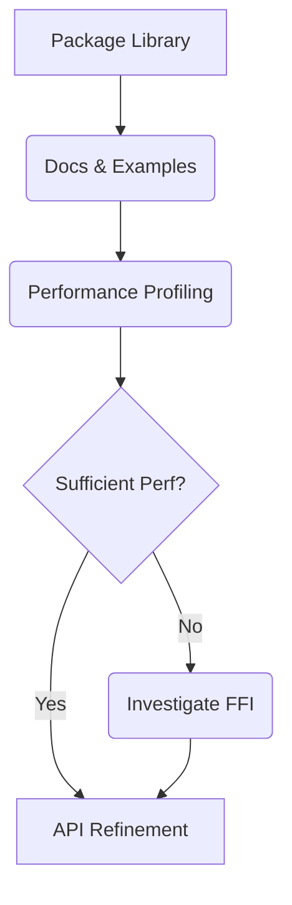

# Project Brief: NumDart - A NumPy-like Package for Dart

## 1. Project Goal

To create a Dart package, tentatively named "NumDart", that provides
functionality similar to Python's NumPy library. The primary goals are:

- **API Compatibility:** Mimic NumPy's flexible and powerful API design where
  feasible.
- **Performance:** Strive for performance comparable to NumPy for core
  operations, especially within the target platform context.
- **Target Platform:** Initially focus on Flutter, with potential for future
  cross-platform support.

## 2. Core Requirements (Initial Focus)

Based on initial discussion, the priority features for the first phases are:

- **Core Data Structure (`NdArray`):**
  - Multi-dimensional array representation.
  - Internal storage using Dart's `TypedData` for efficiency.
  - Management of shape, strides, and data types (`dtype`).
  - Handling of views (shared data buffer with different shape/strides/offset).
- **Basic Array Creation:** Functions like `array()`, `zeros()`, `ones()`,
  `arange()`, `linspace()`.
- **Indexing and Slicing:**
  - Support for integer indexing (`operator []`).
  - Support for basic slicing using `Slice` objects (`operator []`).
  - Support for element assignment (`operator []=`).
- **Reshaping:** `reshape()` method to change array dimensions (returning a
  view).
- **Element-wise Mathematical Operations:** Basic arithmetic (`+`, `-`, `*`,
  `/`) and common math functions.
- **Broadcasting:** Implementing NumPy's broadcasting rules for operations
  between arrays of different shapes.

## 3. Development Plan (Phased Approach)

### Phase 1: Foundation - Core Data Structure & Basic Operations (Largely Complete)

- **Tasks:**
  - Design and implement the `NdArray` class (using `TypedData`,
    shape/strides/offset management).
  - Implement basic array creation functions (`array`, `zeros`, `ones`,
    `arange`, `linspace`).
  - Implement fundamental indexing (`operator []` for integers) and assignment
    (`operator []=` for integers).
  - Implement basic slicing (`operator []` for `Slice` objects, returning
    views).
  - Implement `reshape()` method (returning views).
  - Set up a robust testing framework (`package:test`).
- **Status:** Mostly complete. Basic slicing has a known bug with negative
  steps. Slice assignment is pending.

### Phase 2: Math & Broadcasting (Next Steps)

- **Tasks:**
  - Implement element-wise mathematical operations (including operator
    overloading).
  - Implement NumPy's broadcasting mechanism.
  - Implement slice assignment (requires broadcasting).
  - Conduct initial performance analysis and benchmarking.
- **Goal:** Enable basic numerical computations on arrays.

### Phase 3: Flutter Integration & Optimization

- **Tasks:**
  - Package the library for Dart/Flutter.
  - Write documentation and usage examples.
  - Perform detailed performance profiling (Dart DevTools).
  - Optimize pure Dart code based on profiling.
  - _If necessary:_ Investigate Dart FFI for calling native C/C++ libraries.
  - Refine API based on usability.
- **Goal:** Deliver a usable and reasonably performant package for Flutter
  developers.

### Future Stages

- Linear Algebra module (`linalg`).
- Random number generation (`random`).
- Advanced indexing (boolean, fancy).
- Integration with other Dart libraries.
- Fix known slicing bug.

## 4. Key Challenges

- **Performance:** Achieving near-NumPy performance in pure Dart will be
  difficult. FFI might be required.
- **API Complexity:** Faithfully replicating NumPy's API nuances is a
  significant undertaking.
- **Slicing Bugs:** Debugging issues like the negative step slicing bug can be
  tricky.

## 5. Initial Decisions

- Start development from scratch.
- Prioritize core array features and math operations for Flutter.
- Use `TypedData` for internal storage.
- Adopt a phased development approach.
- Slicing and reshaping return views, not copies, where possible.
